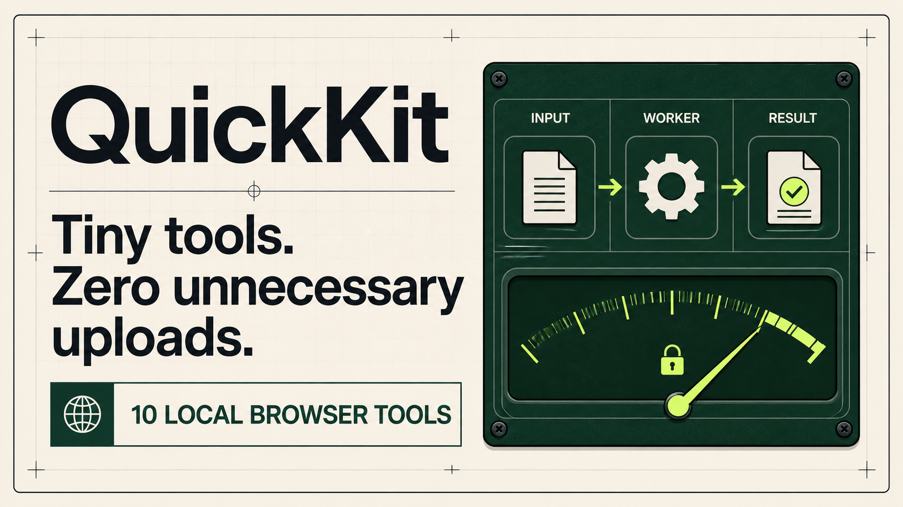

# QuickKit



QuickKit is a privacy-first browser utility suite for people who need small jobs done quickly. Its ten MVP tools format, inspect, convert, compare, and analyze content locally—without an account or an unnecessary upload.

## Tools

| Category | Tools |
| --- | --- |
| Data | JSON Formatter & Validator, JSON Diff, JSON to TypeScript |
| Text | Text Diff, Regex Tester, Text Inspector |
| Developer | JWT Decoder, URL Inspector, Cron Explainer |
| Files | CSV Viewer |

Each tool has a shareable route, a visible local-processing badge, fictional example data, keyboard-friendly controls, and a compact explanation of its data handling.

## Privacy promise

Core tool content is processed inside the browser. QuickKit does not send pasted text, JSON, JWTs, cron expressions, URLs, or CSV content to a product server. Inputs and outputs are not stored. JWT content is never persisted.

The complete storage audit is in [docs/privacy.md](./docs/privacy.md).

## Architecture

```text
Tool registry -> route + search + favorites + command palette
                              |
User input -> worker client -> Web Worker -> pure operation -> local result
                              |
                    no content persistence
                    no tool-content network request
```

JSON formatting, structural JSON diffing, JSON-to-TypeScript inference, text diffing, and CSV parsing use a module Web Worker. Tool components keep state local and disposable. The service worker caches only the application shell and same-origin application assets.

See [docs/architecture.md](./docs/architecture.md) for the worker and PWA boundaries.

## Local setup

Prerequisites: Node.js 22.13 or newer and pnpm.

```bash
pnpm install
pnpm dev
```

Then open the local URL printed in the terminal.

## Verification

```bash
pnpm build
pnpm test
pnpm lint
```

The server-render check verifies the product home and the absence of starter-preview metadata. Source-level privacy checks verify the worker facade and documented persistence boundary.

## Performance

The first implementation moves heavy deterministic operations to a worker and bounds rendered CSV rows to 60 per page. Text diff uses exact LCS for moderate inputs and a bounded comparison for very large matrices. Published hardware/browser benchmarks are intentionally deferred until the release-hardening fixtures have been measured; see [docs/performance.md](./docs/performance.md).

## Accessibility

- Semantic buttons, fields, labels, tables, dialogs, and landmarks
- Visible focus indicators and non-color status text
- `Cmd/Ctrl + K` command palette and `Escape` dismissal
- JSON Formatter run and copy shortcuts
- Responsive single-column tool workspaces on small screens
- System theme support and a reduced-motion preference
- Plain textareas instead of an inaccessible editor-only experience

## Browser compatibility

QuickKit targets current Chrome, Edge, Firefox, and Safari. Clipboard access depends on browser permission and a secure context. Offline behavior activates in production after the service worker is registered. All file tools retain standard file-input and text-paste fallbacks.

## Known limitations

- CSV rendering uses paging rather than full row virtualization in this first release.
- Cron uses standard five-field syntax and the browser timezone; six-field dialects are intentionally unsupported.
- JSON tree view, regex replacement, array-ID JSON diffing, and formal performance benchmarks remain post-MVP polish.
- The optional AI explanation feature is intentionally not implemented.

## Roadmap

After the ten core tools are polished and benchmarked: image compression, QR generation, UUID generation, Web Crypto hashing, timestamp conversion, and Markdown preview. Accounts, cloud storage, a general chatbot, server-side file processing, and dozens of shallow utilities remain explicit non-goals.
